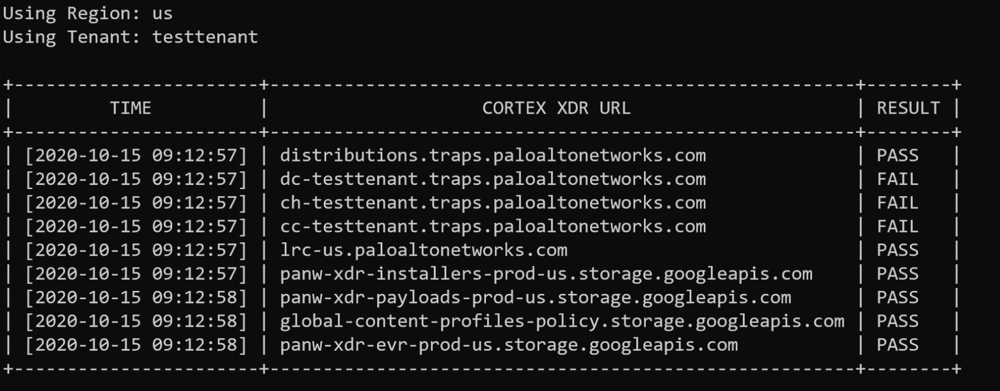
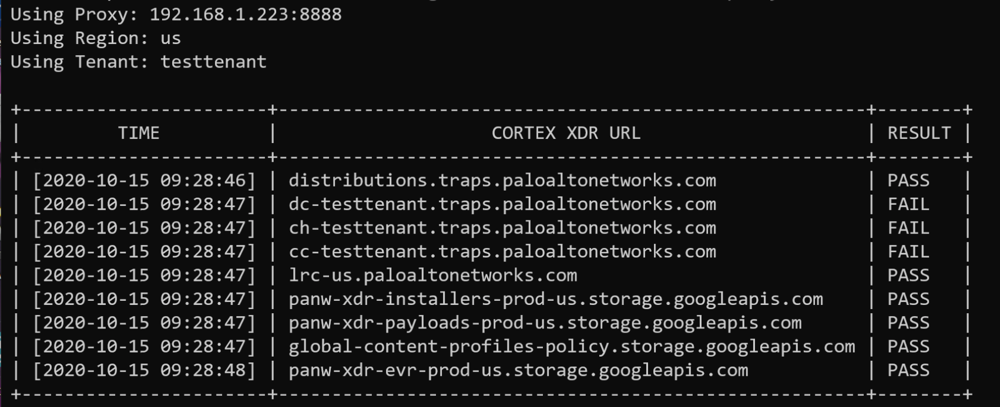

# CortexXDRConnTest

CortexXDRConnTest is a simple cli tool test your endpoint's connection to Cortex XDR communication servers and storage buckets. 

# Usage Documentation

### Getting Help

`CortexXDRConnTest -h , --help`

### Test Connection 

`CortexXDRConnTest -region us -tenant testtenant`

### Test Connection with Proxy

`CortexXDRConnTest -region us -tenant testtenant -proxy 192.168.1.223:8888`

